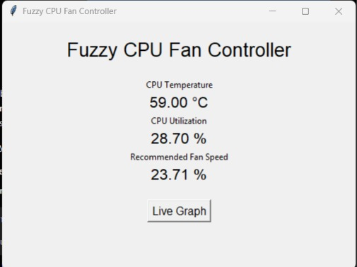
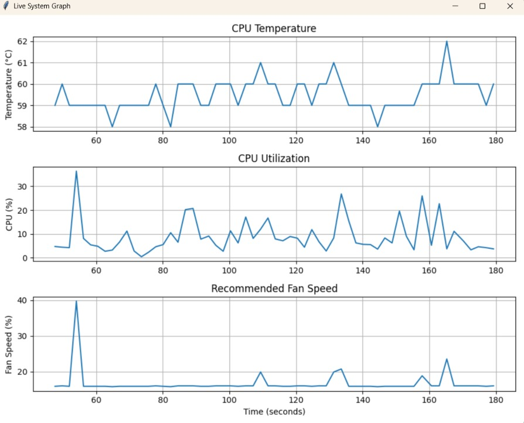
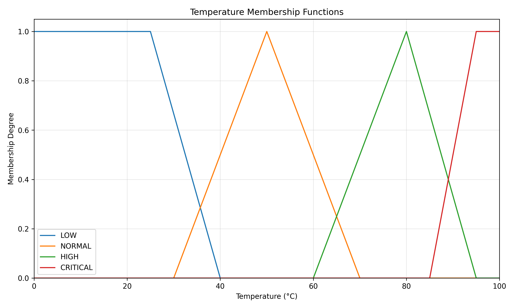
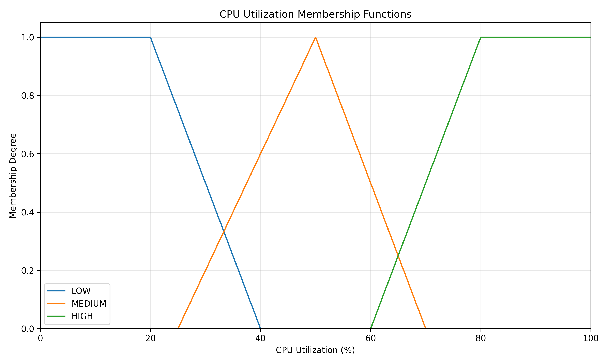
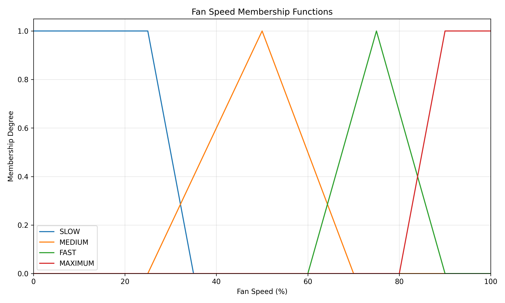
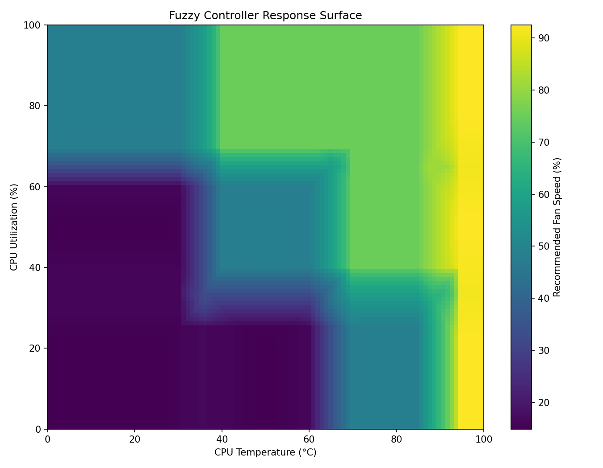
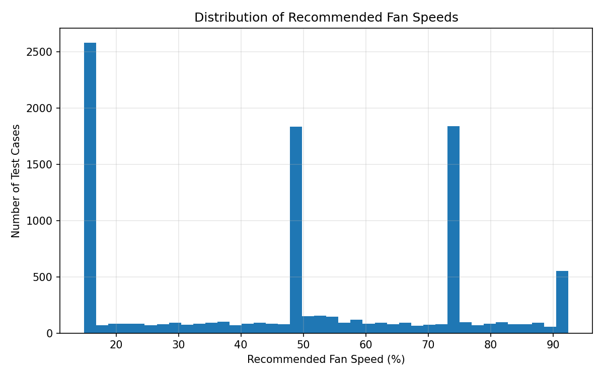
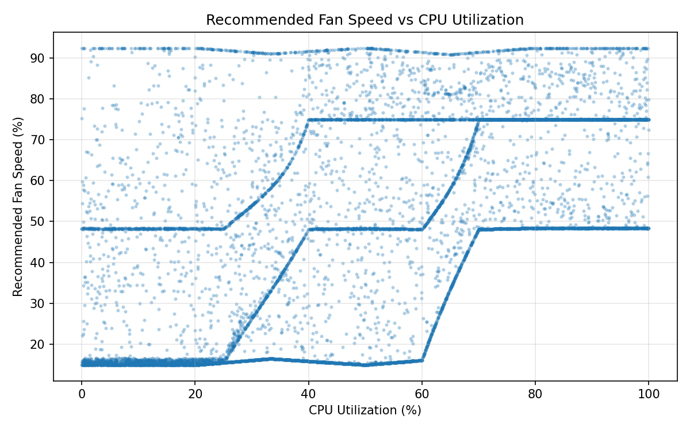
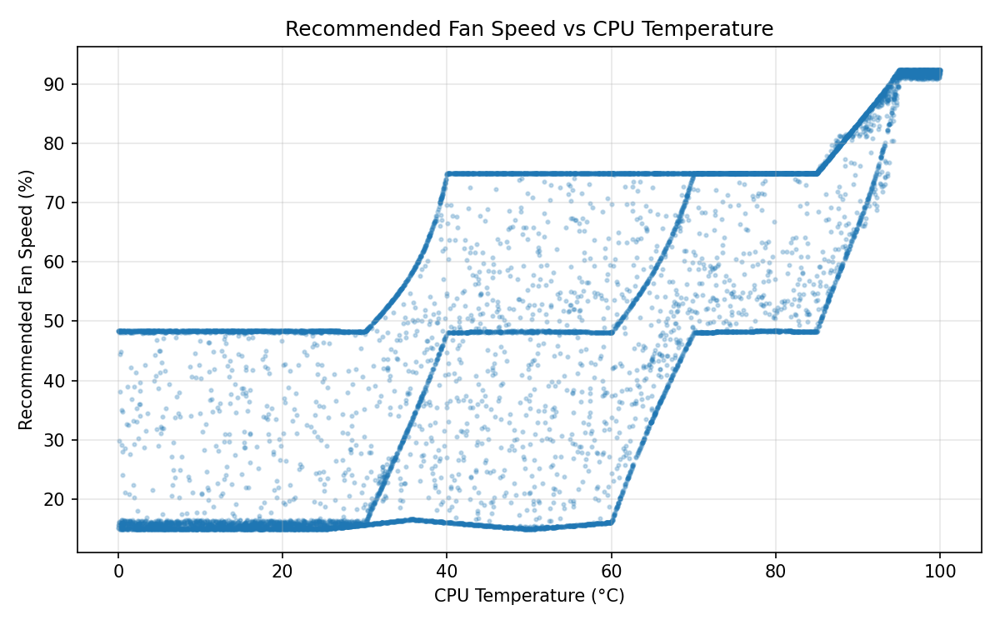

# Fuzzy CPU Fan Controller

A Python-based **Mamdani Fuzzy Logic CPU Fan Controller** that uses CPU temperature and CPU utilization to calculate a recommended fan-speed percentage.

The project was developed from scratch as a fuzzy-logic controller and then extended to work with **live CPU data from a Lenovo LOQ** using **Libre Hardware Monitor, WMI, and psutil**.

A **Tkinter GUI** provides real-time monitoring and live visualization, while a separate automated test suite evaluates the controller across a large input space.

> **Important:** The current implementation calculates a **recommended fan speed**. It does **not** directly control the physical laptop fan.

---

## Features

- Mamdani fuzzy inference system
- Triangular and trapezoidal membership functions
- CPU temperature fuzzification
- CPU utilization fuzzification
- 12-rule fuzzy rule base
- Min-based fuzzy AND
- Max-based consequent aggregation
- Centroid defuzzification
- Real CPU temperature monitoring
- Real CPU utilization monitoring
- Background WMI/COM processing
- Tkinter GUI
- Live system graphs
- Manual test cases
- 10,000-case automated testing
- Complete 10,201-point input-space evaluation
- CSV export of automated test data
- Response-surface visualization

---

# Demo

## Live Tkinter Interface



The GUI displays:

- CPU temperature
- CPU utilization
- Recommended fan speed
- Live graph option

## Live System Graph



The live graph records the latest 60 measurements for:

- CPU temperature
- CPU utilization
- Recommended fan speed

---

# System Architecture

```text
                         REAL SYSTEM
                              │
                ┌─────────────┴─────────────┐
                │                           │
                ▼                           ▼
        CPU Temperature             CPU Utilization
                │                           │
                └─────────────┬─────────────┘
                              │
                              ▼
                       Fuzzification
                              │
                              ▼
                       Fuzzy Rule Base
                              │
                              ▼
                         Implication
                              │
                              ▼
                         Aggregation
                              │
                              ▼
                      Defuzzification
                              │
                              ▼
                  Recommended Fan Speed
                              │
                              ▼
                         Tkinter GUI
```

---

# Fuzzy Logic Pipeline

The controller follows the standard Mamdani fuzzy-inference pipeline.

### 1. Fuzzification

Crisp inputs are converted into fuzzy membership values.

```text
CPU Temperature
       │
       ├── Low
       ├── Normal
       ├── High
       └── Critical

CPU Utilization
       │
       ├── Low
       ├── Medium
       └── High
```

### 2. Rule Evaluation

The controller evaluates the 12 fuzzy rules using:

```text
AND = min
```

Example:

```text
IF temperature is HIGH
AND CPU utilization is MEDIUM
THEN fan speed is FAST
```

### 3. Implication

Each rule clips its consequent membership function according to its firing strength.

### 4. Aggregation

Consequents from multiple rules are combined using:

```text
Aggregation = max
```

### 5. Defuzzification

The final aggregated fuzzy set is converted into a crisp fan-speed percentage using the **centroid method**.

---

# Fuzzy Variables

## CPU Temperature

| Fuzzy Set | Membership Parameters |
|---|---|
| Low | `(0, 0, 25, 40)` |
| Normal | `(30, 50, 70)` |
| High | `(60, 80, 95)` |
| Critical | `(85, 95, 100, 100)` |

## CPU Utilization

| Fuzzy Set | Membership Parameters |
|---|---|
| Low | `(0, 0, 20, 40)` |
| Medium | `(25, 50, 70)` |
| High | `(60, 80, 100, 100)` |

## Fan Speed

| Fuzzy Set | Membership Parameters |
|---|---|
| Slow | `(0, 0, 25, 35)` |
| Medium | `(25, 50, 70)` |
| Fast | `(60, 75, 90)` |
| Maximum | `(80, 90, 100, 100)` |

---

# Membership Functions

## Temperature Membership Functions



## CPU Utilization Membership Functions



## Fan Speed Membership Functions



---

# Fuzzy Rule Base

The controller currently contains 12 rules.

| # | Temperature | CPU Utilization | Fan Speed |
|---:|---|---|---|
| 1 | Low | Low | Slow |
| 2 | Low | Medium | Slow |
| 3 | Low | High | Medium |
| 4 | Normal | Low | Slow |
| 5 | Normal | Medium | Medium |
| 6 | Normal | High | Fast |
| 7 | High | Low | Medium |
| 8 | High | Medium | Fast |
| 9 | High | High | Fast |
| 10 | Critical | Low | Maximum |
| 11 | Critical | Medium | Maximum |
| 12 | Critical | High | Maximum |

---

# Real-System Integration

## CPU Utilization

CPU utilization is measured using `psutil`.

```python
cpu = psutil.cpu_percent(interval=0.2)
```

The measurement is performed in a background thread so that the Tkinter event loop remains responsive.

## CPU Temperature

Libre Hardware Monitor exposes hardware sensor data through WMI.

The project reads:

```text
CPU Package
```

from:

```text
root\LibreHardwareMonitor
```

The relevant integration is implemented in `real_system.py`.

## Background WMI Processing

WMI uses COM, so the worker thread initializes COM before accessing the sensor:

```python
pythoncom.CoInitialize()
```

After the sensor-reading operation:

```python
pythoncom.CoUninitialize()
```

The GUI is updated using Tkinter's event loop:

```python
root.after(...)
```

This keeps hardware monitoring work away from the main GUI thread and prevents WMI calls from blocking the interface.

---

# Testing and Validation

The controller was tested at three levels:

```text
                         TESTING
                            │
            ┌───────────────┼───────────────┐
            │               │               │
            ▼               ▼               ▼
        Manual Tests   Automated Tests   Real-System Test
            │               │               │
            ▼               ▼               ▼
        10 cases       10,000 cases     Live CPU data
                            │
                            ▼
                     10,201-point
                   complete input grid
```

---

## 1. Manual Test Cases

Representative operating conditions were passed through the complete fuzzy inference pipeline.

| Test | Temperature | CPU Utilization | Recommended Fan Speed |
|---:|---:|---:|---:|
| 1 | 30°C | 10% | 15.63% |
| 2 | 55°C | 40% | 48.14% |
| 3 | 75°C | 80% | 75.00% |
| 4 | 95°C | 90% | 92.48% |
| 5 | 20°C | 10% | 14.89% |
| 6 | 50°C | 50% | 48.33% |
| 7 | 80°C | 50% | 75.00% |
| 8 | 90°C | 20% | 66.13% |
| 9 | 70°C | 100% | 75.00% |
| 10 | 100°C | 100% | 92.48% |

These cases cover different combinations of temperature and CPU utilization across the defined fuzzy input ranges.

---

# 2. Automated Testing

`test_controller.py` generates **10,000 random temperature/CPU-utilization combinations** over the complete input domain:

```text
CPU Temperature:  0–100°C
CPU Utilization:  0–100%
```

For each generated input pair, the complete fuzzy controller is executed:

```text
Temperature + CPU Utilization
              │
              ▼
         Fuzzification
              │
              ▼
         Rule Evaluation
              │
              ▼
           Implication
              │
              ▼
          Aggregation
              │
              ▼
        Defuzzification
              │
              ▼
      Recommended Fan Speed
```

The exact generated inputs and outputs are saved to:

```text
test_figures/controller_test_dataset.csv
```

---

## Complete Input-Space Evaluation

In addition to the 10,000 random test cases, the controller was evaluated at every integer combination of the two input variables:

```text
101 temperature values
          ×
101 CPU-utilization values
          =
10,201 input combinations
```

This provides a complete view of the controller's behavior across the defined `0–100` input domain.

---

# Test Results

## Controller Response Surface



The response surface is the primary visualization of the controller's behavior.

It maps:

```text
X-axis → CPU Temperature
Y-axis → CPU Utilization
Color  → Recommended Fan Speed
```

It shows how the output changes when both inputs vary simultaneously.

---

## Recommended Fan-Speed Distribution



This histogram shows the distribution of recommended fan-speed values across the 10,000 automated test cases.

The concentrations around the major output regions are a consequence of the current membership functions and rule base.

---

## Fan Speed vs CPU Utilization



This plot shows the relationship between CPU utilization and recommended fan speed across the generated test dataset.

Because CPU temperature is also an input, multiple fan-speed recommendations can occur at the same CPU utilization.

---

## Fan Speed vs Temperature



This plot shows the relationship between CPU temperature and recommended fan speed across the generated test dataset.

CPU utilization remains another input, so the output can vary at the same temperature.

---

## Automated Test Statistics

```text
Number of test cases:       10,000
Minimum recommendation:     14.89%
Maximum recommendation:     92.48%
Mean recommendation:        48.70%
```

---

# Real-System Testing

The fuzzy controller was connected to live CPU data from a **Lenovo LOQ**.

```text
             Lenovo LOQ
                  │
        ┌─────────┴─────────┐
        │                   │
        ▼                   ▼
 CPU Package Temp      CPU Utilization
        │                   │
        └─────────┬─────────┘
                  │
                  ▼
           Fuzzy Controller
                  │
                  ▼
        Recommended Fan Speed
```

The GUI continuously collects the latest system measurements.

## Live System Graph


The live graph contains:

- CPU temperature
- CPU utilization
- Recommended fan speed

This demonstrates the controller operating using real hardware measurements rather than only predefined test values.

---

# GUI

The project includes a Tkinter-based graphical interface.


The interface displays the current:

```text
CPU Temperature
CPU Utilization
Recommended Fan Speed
```

and provides a separate live graph window.

---

# Project Structure

```text
cpu_fan/
│
├── cpu_fan.py
│   └── Core fuzzy-logic engine
│
├── real_system.py
│   └── Live CPU monitoring + fuzzy controller
│
├── gui.py
│   └── Tkinter live monitoring interface
│
├── graphs.py
│   └── Static fuzzy-model visualization
│
├── test.py
│   └── Manual controller test cases
│
├── test_controller.py
│   └── Automated 10,000-case controller test
│
├── test_wmi.py
│   └── WMI/LHM sensor inspection
│
├── figures/
│   ├── temperature_memberships.png
│   ├── cpu_memberships.png
│   ├── fan_speed_memberships.png
│   ├── fan_speed_vs_temperature.png
│   └── fan_speed_vs_cpu.png
│
├── test_figures/
│   ├── controller_response_surface.png
│   ├── fan_speed_distribution.png
│   ├── fan_speed_vs_cpu_usage.png
│   ├── fan_speed_vs_temperature.png
│   └── controller_test_dataset.csv
│
├── README_assets/
│   ├── gui.jpeg
│   └── live_graph.jpeg
│
└── README.md
```

---

# Installation

Install the required Python packages:

```bash
pip install psutil wmi pywin32 matplotlib
```

For live CPU temperature monitoring, Libre Hardware Monitor must be running.

---

# Running the Project

## Run the fuzzy controller manually

```bash
python cpu_fan.py
```

## Run manual test cases

```bash
python test.py
```

## Generate static visualizations

```bash
python graphs.py
```

## Run automated testing

```bash
python test_controller.py
```

## Run the live GUI

```bash
python gui.py
```

---

# Current Limitations

This project is a **fuzzy thermal-control model**, not the firmware thermal controller used by the laptop.

Currently:

- CPU temperature is monitored in real time.
- CPU utilization is monitored in real time.
- A recommended fan speed is calculated using fuzzy inference.
- The physical laptop fan is **not directly controlled**.
- Actual fan RPM is not currently exposed through the project's Libre Hardware Monitor WMI path.
- The fuzzy controller currently uses only CPU temperature and CPU utilization.

Real laptop thermal management can involve additional parameters such as:

- CPU temperature
- GPU temperature
- CPU/GPU power consumption
- Operating mode
- Thermal limits
- Workload characteristics
- Embedded Controller logic
- Actual fan RPM

Therefore, the fan-speed percentage produced by this project represents the output of the implemented fuzzy model and should not be interpreted as the actual firmware fan-control command.

---

# Future Improvements

- Compare recommended fan speed with actual fan RPM on compatible hardware.
- Add GPU temperature and GPU utilization.
- Include CPU/GPU power consumption.
- Add rate of temperature change as a fuzzy input.
- Add hysteresis to reduce rapid changes in recommendation.
- Compare fuzzy control with conventional threshold-based control.
- Tune membership functions using experimental data.
- Evaluate the controller under controlled CPU workloads.
- Add long-term CSV logging.
- Develop a closed-loop controller when safe hardware control is available.

---

# Technologies

- **Python**
- **Fuzzy Logic**
- **Mamdani Fuzzy Inference**
- **Tkinter**
- **Matplotlib**
- **psutil**
- **WMI**
- **Libre Hardware Monitor**

---

# Project Status

## Working Prototype

Implemented:

- [x] Triangular membership functions
- [x] Trapezoidal membership functions
- [x] Fuzzification
- [x] 12-rule fuzzy rule base
- [x] Rule evaluation
- [x] Mamdani implication
- [x] Output aggregation
- [x] Centroid defuzzification
- [x] Manual test cases
- [x] 10,000-case automated testing
- [x] 10,201-point complete input-space evaluation
- [x] Real CPU temperature monitoring
- [x] Real CPU utilization monitoring
- [x] Tkinter GUI
- [x] Live system visualization

The current implementation focuses on **real-time monitoring and fan-speed recommendation**, with physical fan control intentionally excluded.
